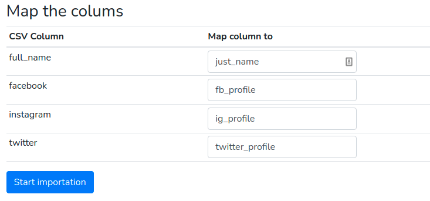

# CSV Field Import Mapper

## Overview
Given a table that has the following fields for contacts (team_id, phone, name, email,sticky_phone_number_id) build a Laravel app that will take an uploaded CSV file, read out the columns, and allow the user to map their CSV's columns to the table's fields. Once done import the file into the contacts table.

Any fields that are not mapped, import into a separate custom_attributes table which has "key" and "value" columns that correlate to the CSV column and row value.

## Technologies
- Laravel 8x;
- Docker with Laravel Sail;
- Mysql;
- Vue.js.

## Architecture
### Database structure

### Project structure
```tree
├── app
│   ├── Http
│   │   └── Controllers
│   │       └── ContactController.php  # Controller used to interact with the API.
│   ├── Services
│   │   └── ContactService.php # Responsible class for "parse", "map" and "import" data into the DB.
│   └── Models #Application models.
├── database
│   └── migrations #Application migrations.
├── public
│   └── csv #Store csv file examples.
├── resources
│   └──js #Application js files
│      └── vue #Store vue template files
```

## Installation:
1. Install [docker and docker-compose](https://docs.docker.com/get-docker/);
2. I'm using [Laravel Sail](https://laravel.com/docs/8.x/sail), for this reason run the following commands:
    - ```
        docker run --rm \
            -u "$(id -u):$(id -g)" \
            -v $(pwd):/var/www/html \
            -w /var/www/html \
            laravelsail/php81-composer:latest \
            composer install --ignore-platform-reqs
      ```
        Note: More information about the command above could be found here: https://laravel.com/docs/8.x/sail#installing-composer-dependencies-for-existing-projects.

    - ```
      ./vendor/bin/sail up
      ```
    - ```
      ./vendor/bin/sail artisan migrate
      ```
    - ```
      ./vendor/bin/sail npm install
      ```
    - ```
      ./vendor/bin/sail npm run dev
       or
      ./vendor/bin/sail npm run watch-poll
      ```
3. Open http://localhost:8081/, you should see a page like that:

    

## Using the application:
1. Choose the .csv file that you want to import and click on the Next button (You can use the file public/csv/custom_columns.csv).


    public/csv/custom_columns.csv example:
    

2. Read the system instruction before start the mapping process.


3. Do the mapping processing and click on the "Start importation" button.


4. The import was successfully completed.
Now we'll check if the csv file data was imported in the "contacts" and "custom_attributes" tables  and if the mappings performed by the user were done correctly.


5. Inside the project database, run the following statements:
    - `select * from contacts;`
    - `select * from custom_attributes;`

6. Check the results of contacts table:

    

7. Check the results of custom_attributes table:

    
